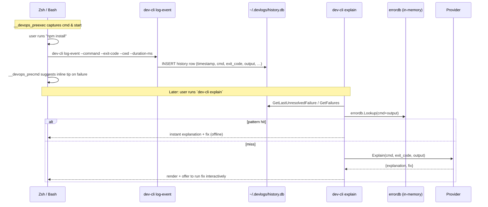
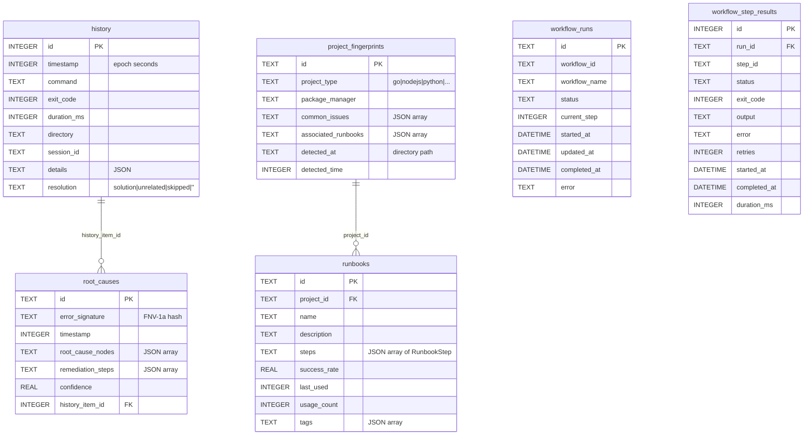

# dev-cli — Codebase Knowledge Document

> Self-contained brain dump for AI agents working on `dev-cli`. Generated by exploring the repository directly. Every claim is anchored to a file path; every feature is mapped to its business purpose.
>
> **Companion artifact:** A static product-release landing page lives at [`web/index.html`](../web/index.html). See [`web/README.md`](../web/README.md) for design notes and deployment options.

---

## Table of Contents

1. [High-Level Overview](#1-high-level-overview)
2. [System Architecture](#2-system-architecture)
3. [Feature-by-Feature Analysis](#3-feature-by-feature-analysis)
4. [Cross-Feature Interaction Map](#4-cross-feature-interaction-map)
5. [Nuances, Subtleties & Gotchas](#5-nuances-subtleties--gotchas)
6. [Technical Reference](#6-technical-reference)
7. [Glossary](#7-glossary)
8. [State Block / Open Questions](#8-state-block--open-questions)

---

## 1. High-Level Overview

### 1.1 What it is

**`dev-cli`** is a Go-based, AI-powered DevOps terminal companion (a Cobra CLI). It wraps a small set of shared "tools" with an LLM-driven agent loop that can autonomously diagnose and (with safe-mode approval) repair developer/DevOps issues. It is local-first (Ollama default) but transparently routes tool-calling work to a cloud OpenAI-compatible endpoint when one is configured, because small local models often misformat function-calls.

- **Module:** `dev-cli` (Go 1.25.4) — see `go.mod:1-3`
- **Entrypoint:** `main.go:11` → `cmd.Execute()`
- **Domain:** developer tooling / SRE assistant on a single workstation
- **Target user:** an individual developer/DevOps engineer working in a terminal who wants:
  - instant analysis of why a command failed,
  - one-shot research/cheat-sheets for tools,
  - an autonomous agent that can read files, run diagnostic commands, and propose fixes — with a hard safety gate in front of destructive actions,
  - a local-first experience (no data leaving the machine when Ollama is running).

### 1.2 Tech stack

| Layer | Choice | Where |
|------|--------|------|
| Language | Go 1.25 | `go.mod` |
| CLI framework | `spf13/cobra` v1.10 | `cmd/root.go` |
| LLM SDK | `openai/openai-go` v1.12 (used for both OpenAI cloud, Ollama local, and Perplexity — all expose the OpenAI-compatible chat-completions API) | `internal/llm/openai_sdk.go` |
| Storage | SQLite via `modernc.org/sqlite` (CGO-free) | `internal/storage/db.go` |
| TUI | `charmbracelet/bubbletea` + `bubbles` + `lipgloss` | `internal/tui/` |
| Docker introspection | `docker/docker` SDK + `testcontainers-go` (tests) | `internal/infra/docker.go` |
| Spinner | `briandowns/spinner` | `internal/llm/agent.go:148` |
| YAML config | `gopkg.in/yaml.v3` | `internal/config/config.go` |
| PTY | `creack/pty` | `internal/executor/pty.go` |
| MCP (deferred) | `mark3labs/mcp-go` (build target only, no implementation in `cmd/mcp/` yet) | `Makefile:14`, `.goreleaser.yaml:33` |
| Release | GoReleaser | `.goreleaser.yaml` |
| Lint | golangci-lint (errcheck, govet, staticcheck, revive, gosec, …) | `.golangci.yml` |
| CI | GitHub Actions: lint → test (race) → matrix build (linux/darwin/windows × amd64/arm64) | `.github/workflows/ci.yml` |

### 1.3 Architectural style

A classic **layered Cobra CLI** with a **shared domain core**:

```
cmd/                 ← presentation: Cobra subcommands, output, prompts
  └─ depends on internal/{llm, tools, workflow, storage, config, …}

internal/llm/        ← Provider interface + Agent loop + HybridClient routing
internal/tools/      ← 10+ reusable Tools (the registry the Agent calls)
internal/workflow/   ← Safe-mode + Engine that wraps tool execution
internal/executor/   ← os/exec helpers + canonical danger-pattern lists
internal/storage/    ← SQLite schema, history, runbooks, RCA
internal/config/     ← single Config struct (env > yaml > defaults)
internal/pipeline/   ← typed event bus + plugin lifecycle (used by TUI)
internal/tui/        ← bubbletea dashboard (Agent / Containers / History tabs)
internal/infra/      ← Docker / Ollama / GPU / system probes
internal/health/     ← `doctor` checks (composes infra + llm)
internal/hook/       ← embedded zsh/bash shell-integration scripts
internal/memory/     ← thin shim over external MemPalace CLI (recall + write-back)
internal/errordb/    ← built-in pattern database for instant explanations
internal/diffsandbox/← in-memory file-change tracker + cumulative diff view
internal/plugins/    ← TUI-side plugins (ai, command) that listen to pipeline events
```

The "agent" is not a long-running daemon. Each command builds a fresh `*Agent` with its dependencies wired explicitly (`llm.NewAgentWithDeps`), runs one task, and exits.

### 1.4 Top-level features and the business purpose of each

| Command | File | Business purpose |
|---|---|---|
| `fix <issue>` | `cmd/fix.go` | Reduce time-to-resolution for known/unknown ops issues. The autonomous agent can read files, search the code, inspect git/docker/ports, and attempt a fix — with a safe-mode approval gate so the user keeps control of writes and shell commands. |
| `explain` (aliases `why`, `rca`) | `cmd/explain.go` | Eliminate the "what does this stack trace mean?" round-trip to Stack Overflow. First checks a built-in 50+ pattern database (`internal/errordb`) for an instant offline answer; falls back to an LLM only when no pattern matches. |
| `ask <topic>` | `cmd/ask.go` | DevOps research assistant. Two modes: (1) tool-cheat-sheet mode (`dev-cli ask kubectl`) and (2) research mode (`dev-cli ask "how to mount NTFS"`). Routes to Perplexity when query keywords suggest web search; otherwise local Ollama. Cached for 10 min. |
| `ui` | `cmd/ui.go` | Interactive bubbletea dashboard with Agent / Containers / History tabs. Useful for monitoring + chat without leaving the terminal. |
| `doctor` | `cmd/doctor.go` | Tell the user *why* `dev-cli` won't work right now (Docker down, Ollama unreachable, no GPU, no LLM provider, MemPalace missing) — and offer a one-keystroke fix. |
| `init zsh` / `init bash` | `cmd/init.go` (+ `internal/hook/`) | Print a shell hook that auto-captures every command's exit code into the SQLite history so `explain` has data to analyze. |
| `models list/pull/rm` | `cmd/models.go` | Manage local Ollama models without leaving the CLI; pulls stream a progress bar. |
| `memory search/stats/ingest/store` | `cmd/memory.go` | Optional hybrid recall (vector + BM25 + cross-encoder rerank) over Claude Code transcripts, Obsidian notes, and dev-cli's own runbooks via the external `mempalace` binary. |
| `runbook list/show/replay/rm` | `cmd/runbook.go` | Reuse runbooks that `fix` recorded automatically when it succeeded — replay them without an LLM call. |
| `commit` | `cmd/commit.go` | Stage-aware Conventional-Commits message generator. Reviews the staged diff, calls the LLM, prompts for accept/edit. Never pushes. |
| `pr` | `cmd/pr.go` | Generate a PR title + body from commits on the current branch (vs `origin/main` by default). Defaults to dry-run; `--push` actually calls `gh pr create`. Never force-pushes. |
| `review` | `cmd/review.go` | LLM code review of a diff (staged / `--since <ref>` / `--pr`) with structured findings (`severity`, `file:line`, rationale, suggestion); emits text or JSON. |
| `gen <kind> <target>` | `cmd/gen.go` | Use the same agent loop as `fix`, but with a restricted tool registry (`read_file`/`read_dir`/`write_file`/`search_codebase`) to scaffold tests, migrations, fixtures. |
| `test` | `cmd/test.go` | Auto-detect the project's test runner (Go / npm / pytest / cargo / `$DEV_CLI_TEST_CMD`), run it, and on failure offer to hand the failing block to `fix`. |
| `config init/show/set/get` | `cmd/config.go` | Manage `~/.devlogs/config.yaml`. |
| `export` | `cmd/export.go` | Export a Docker container's logs (or a file's tail) into `~/.devlogs/last-error.md` for handing off to a different tool (e.g. OpenCode). |
| `mark-resolved` (hidden) | `cmd/mark_resolved.go` | Internal: mark a history row as `solution`/`unrelated`/`skipped`. Used by the shell hook flow. |
| `log-event` (hidden) | `cmd/init.go:44` | Internal: invoked by the zsh/bash hook to write each command into SQLite. |
| `version` | `cmd/version.go` | `dev-cli version [--json]`. ldflags-injected version/commit/date. |

### 1.5 Headline business outcomes

1. **Trust-first agentic coding.** Safe Mode (the project's #1 priority — see `AGENTS.md:5`, `.context/AGENT_CONTEXT.md:21`) blocks 75+ dangerous shell patterns and 50+ sensitive file patterns, with severity levels (warning / danger / critical) and a `--dry-run` mode for `fix`.
2. **Local-first privacy.** Default model is Ollama `smallthinker`. Cloud is opt-in per env-var. `--local` / `DEV_CLI_FORCE_LOCAL=1` pin everything offline.
3. **Learn-from-success.** When `fix` resolves an issue, its successful tool calls are automatically persisted as a **Runbook** keyed to the project fingerprint (Go / Node / Python / …). Future `fix` invocations for the same project + similar issue offer to **replay the runbook without calling the LLM**. See `internal/storage/runbook_learn.go` and `cmd/fix.go:198-213`.
4. **Cross-tool memory.** When MemPalace is enabled, every command (`ask`, `explain`, `fix`, `pr`, `review`, `gen`, `commit`) prepends recalled memories to its prompt; `fix` and `pr` write their outcomes back. See `internal/memory/mempalace.go` and `cmd/memory_writeback.go`.

---

## 2. System Architecture

### 2.1 Layer diagram

```mermaid
flowchart TB
  user([User]) -->|args| cobra[cmd/* Cobra command]
  cobra --> cfg[internal/config<br/>env > YAML > defaults]
  cobra --> agent[internal/llm.Agent]
  cobra --> tools[internal/tools.Registry]
  cobra --> engine[internal/workflow.Engine]
  cobra --> store[internal/storage<br/>SQLite]

  agent -->|ChatCompletion| hybrid[llm.HybridClient]
  hybrid -->|tools? cloud key?| openai[OpenAIProvider]
  hybrid -->|sonar*| perp[PerplexityProvider]
  hybrid -->|fallback| ollama[OllamaProvider]
  openai & perp & ollama -->|openai-go SDK| net[(HTTPS / localhost:11434)]

  agent -->|each tool call| engine
  engine -->|safe-mode check| safety[internal/executor.safety<br/>75+ danger patterns<br/>50+ sensitive files]
  engine -->|approved| tool[(Tool.Execute)]
  tool --> registry[Tool implementations<br/>file/cmd/git/docker/...]

  cobra -.shell hook.-> hook[internal/hook<br/>zsh/bash scripts]
  hook -->|log-event| store
  store -->|runbook learn| memwriteback[memory write-back<br/>cmd/memory_writeback.go]
  memwriteback --> mempal[external mempalace CLI]

  ui[cmd/ui] --> tui[internal/tui]
  tui --> pipe[internal/pipeline.EventBus]
  pipe --> plug[internal/plugins/{ai,command}]
```

### 2.2 The agent loop (heart of the system)

```mermaid
sequenceDiagram
    participant U as User
    participant F as cmd/fix.go
    participant A as llm.Agent
    participant P as Provider (Hybrid → OpenAI/Ollama/Perplexity)
    participant E as workflow.Engine
    participant T as tools.Tool
    participant S as storage SQLite

    U->>F: dev-cli fix "<issue>"
    F->>F: check storage for replayable runbook
    alt runbook match (success-rate ≥ 0.7)
        F->>E: ExecuteToolStep × N (no LLM)
        F->>S: UpdateRunbookStats
    else no match
        F->>A: Resolve(issue, system_prompt)
        loop ≤ MaxIterations (default 10)
            A->>P: ChatCompletion(messages, tool_defs)
            P-->>A: ChatResponse{content, tool_calls}
            alt no tool_calls
                A-->>F: success summary
                A->>S: RecordRunbookFromAgent (success only)
            else tool_calls
                loop each tool_call
                    A->>F: ApprovalFunc(tool, params)
                    Note over F: prompts user;<br/>diffsandbox.Snapshot before write_file
                    F-->>A: approved? bool
                    A->>E: ExecuteToolStep
                    E->>E: isDestructiveTool? checkSafety
                    E->>T: tool.Execute(ctx, params)
                    T-->>E: ToolResult
                    E-->>A: StepResponse
                    A->>P: append tool result to messages
                end
            end
        end
    end
    F->>U: print summary + cumulative diff + offer rollback
```

Key references:
- Loop body — `internal/llm/agent.go:153-209`
- Runbook replay path — `cmd/fix.go:198-213`, `findReplayableRunbook` at `cmd/fix.go:332-354`
- `executeToolCall` — `internal/llm/agent.go:212-295`
- Safe-mode interception — `internal/workflow/engine.go:442-545`
- Recording successful runbooks — `internal/llm/agent.go:367-396` → `internal/storage/runbook_learn.go:72-128`

### 2.3 LLM provider routing (`HybridClient`)

`internal/llm/hybrid.go:178-195` — exact precedence (in order):

1. **Cloud OpenAI-compatible** — if `cfg.OpenAIKey != ""` AND `!cfg.ForceLocalLLM` AND the request has tools (`len(req.Tools) > 0`). Reason in code comment: small local models frequently mis-format function-calls. The model tag is rewritten from the Ollama name to `cfg.OpenAIModel` so cloud APIs accept it.
2. **Perplexity** — if model name starts with `sonar` AND key set.
3. **Ollama** — fallback for everything else, including non-tool chats (cheat-sheets, free-form research, error explanations) and any request when `DEV_CLI_FORCE_LOCAL` is set.

Web-search short-circuit (`Research` only): `needsWebSearch(query)` (`internal/llm/hybrid.go:288-299`) keyword-matches `install/latest/version/how to/compare/why/best/setup/configure/deploy/update/upgrade` → if matched, route to Perplexity; else Ollama.

A 10-minute LRU response cache (`internal/llm/hybrid.go:60-146`) memoises `Research` calls by SHA-256 of the query (50-entry LRU). Tool-calling chats are NOT cached.

### 2.4 Data flow: command lifecycle (with shell hook)



### 2.5 Cross-cutting concerns

| Concern | Where it lives | Notes |
|---|---|---|
| **Safety patterns (canonical)** | `internal/executor/safety.go` | 75+ shell danger patterns, 50+ sensitive-file globs, sensitive directories. Re-exported by `internal/workflow/safemode.go:62-64` so executor remains source of truth. |
| **Safety enforcement points** | `internal/tools/file_tools.go:60-64,185-189` (read/write file), `internal/tools/command_tools.go:46-49` (run_command), `internal/workflow/engine.go:442-476` (safe-mode gate) | Every destructive surface checks `executor.CheckCommandSafety` / `CheckFileSafety` before action. |
| **Approval flow** | `cmd/fix.go:90-103` (engine-level), `cmd/fix.go:121-192` (per-call approval prompt + diff snapshot) | Three modes: dry-run / safe-execute / auto-approve. |
| **Logging / history** | `internal/storage/repository.go` + zsh/bash hook `internal/hook/zsh.go,bash.go` | All commands captured on the user's machine; never leaves it unless cloud LLM is invoked. |
| **Event bus** | `internal/pipeline/{events.go,pipeline.go,state.go}` | Used by the TUI plugin system; the workflow engine also publishes `workflow.start/step/complete/rollback/tool_step` events. |
| **Caching** | `internal/llm/cache.go` (research cache), `internal/llm/hybrid.go:60-146` | TTL + LRU. |
| **Tool registry as singleton** | `internal/tools/registry.go:21-26` | `GetRegistry()` + `RegisterDefaults()` registers 11 tools (`ReadFile`, `ReadDir`, `WriteFile`, `RunCommand`, `SearchCodebase`, `QueryDocker`, `CheckPorts`, `GitInfo`, `PackageInfo`, `GitInspector`, `ReadDiff`). |
| **Memory recall (optional)** | `internal/memory/{mempalace.go,client.go,search.go,store.go,wing.go}` + `cmd/memory_writeback.go` | Always best-effort: missing binary → silent no-op. |

### 2.6 Configuration precedence

`internal/config/config.go:42-139`:

```
defaults  <  YAML file (~/.devlogs/config.yaml)  <  environment variables
```

Notable resolution rules:
- `LogDir` defaults to `~/.devlogs`. If `XDG_DATA_HOME` is set AND `~/.devlogs` does NOT already exist, default flips to `$XDG_DATA_HOME/dev-cli` — explicitly to avoid orphaning history on upgrade.
- `OPENAI_API_KEY` and `OPENAI_BASE_URL` / `OPENAI_MODEL` are accepted as aliases for the `DEV_CLI_*` variants.
- `DEV_CLI_FORCE_LOCAL` is a presence-based switch (any non-empty value flips it on).
- The YAML file is read with `yaml.v3`; malformed files are silently ignored — never blocks the binary.

---

## 3. Feature-by-Feature Analysis

For each feature: **business purpose → entry points → control flow → side effects → cross-feature dependencies → edge cases.**

### 3.1 `fix` — Autonomous agent

**Business purpose:** Cut the average time spent on "ops chores" by letting an LLM read state and propose narrowly-scoped fixes, with a hard human gate in front of every destructive action. The unique selling point vs. competitors is **trust** (safe mode + diff sandbox + rollback) plus **learn-from-success** (runbook capture and replay).

**Entry point:** `cmd/fix.go:33-64` (cobra command, flags `-v --safe --max-iterations --auto-approve --dry-run --scope`).

**Flow** (`cmd/fix.go:66-327`):

1. Load `Config`; pick `(provider, model)` via `llm.SelectAgentModel` (`internal/llm/hybrid.go:270-286`).
2. Build a fresh `tools.Registry` with `RegisterDefaults()` (11 tools).
3. Create a `pipeline.EventBus` and `workflow.Engine` (no checkpoint store — `nil` means in-memory only).
4. Configure safe-mode context:
   - `--dry-run` → `NewSafeModeContext` (preview-only).
   - `--safe` (default true) and not `--auto-approve` → `NewExecuteContext` with stdin y/N prompt.
   - `--auto-approve` → `NewExecuteContext` with auto-true.
5. Wire `agent.SetDB(db)` if SQLite opens — enables runbook learning.
6. Build a `diffsandbox.Tracker` (in-memory file change recorder) for cumulative diff + rollback.
7. Set `AgentConfig` including a custom `ApprovalFunc` that:
   - Honors `--dry-run` (logs would-be action, returns false to skip execution).
   - Enforces `--scope` for `write_file` (rejects writes outside the scope dir).
   - Calls `tracker.Snapshot(path)` *before* writes for diff/rollback.
   - Prompts the user `[y/N]` for `write_file` and `run_command` only.
   - Records `tracker.RecordWrite(path, content)` *after* approval.
8. **Runbook replay attempt** (`cmd/fix.go:198-213`): query SQLite for runbooks matching the current project fingerprint with success_rate ≥ 0.7 and a name/description substring match against `<issue>`. If found, prompt `[Y/n]` and replay each step via `engine.ExecuteToolStep` — no LLM call. Updates runbook stats either way.
9. Inject MemPalace context if enabled (`memory.BuildPromptContext`).
10. Run `agent.Resolve(ctx, taskInput)` → the loop in `internal/llm/agent.go:128-209`.
11. On success → record runbook via `internal/storage/runbook_learn.go:RecordRunbookFromAgent`, which also fires `OnRunbookRecorded` (memory write-back).
12. After the run, regardless of outcome: print the cumulative diff (`tracker.FormatDiff`) and offer rollback (`tracker.Rollback`).

**Side effects:**
- Writes to `~/.devlogs/history.db` (`runbooks`, `root_causes`, `project_fingerprints` tables).
- May fork/exec arbitrary shell commands via the `run_command` tool (after approval + safety check).
- May write/modify any file the user has access to (after approval + safety check + scope check).
- May write to MemPalace via the runbook write-back hook (`cmd/memory_writeback.go:18-36`) — runs in a goroutine with 5s timeout.

**Cross-feature interactions:**
- Shares `tools.Registry` and `workflow.Engine` with `gen` (which uses a *restricted* registry: `read_file`, `read_dir`, `write_file`, `search_codebase` — see `cmd/gen.go:56-60`).
- Reads runbooks/fingerprints written by previous `fix` runs (and potentially by other commands later).
- Calls `executor.Check*Safety` everywhere; the same patterns are surfaced verbatim by `cmd/explain.go:325-335` when prompting before running an LLM-suggested fix.

**Edge cases / hidden behavior:**
- `agent.go:367-396` ONLY records a runbook when (a) `db` is set, (b) `result.Success` is true, (c) `DryRun` is false, AND (d) at least one tool call succeeded. Failed/denied tool calls are filtered — good (we don't replay garbage), but it also means a successful "the LLM just answered without calling tools" run records nothing.
- The runbook matching in `findReplayableRunbook` uses substring containment in either direction (`strings.Contains(hay, needle) || strings.Contains(needle, strings.ToLower(rb.Description))`). This is generous: a 1-word issue can match a long runbook description. Fine in practice but could prompt unintended replays. (`cmd/fix.go:347-352`).
- Output truncation: tool outputs over 4 KB are truncated before being fed back to the LLM (`internal/llm/agent.go:312-318`).
- `MaxIterations` defaults to 10 (`agent.go:23-25`). When exceeded, returns `"max iterations reached"` — does not record a runbook.
- The model used for the agent is *separate* from the model used for `Research` / `Explain` / `CheatSheet` calls. Tool-calling work prefers cloud (`SelectAgentModel`); free-form work always tries local first.

### 3.2 `explain` — Root cause analysis

**Business purpose:** Eliminate context-switching to Stack Overflow / docs when a command fails. Optimized for instant offline answers via a built-in pattern database; LLM only when needed.

**Entry point:** `cmd/explain.go:35-77` (aliases: `why`, `rca`).

**Flow:**
1. Either takes flag-provided `--command`/`--exit-code`/`--output`, or queries SQLite via `storage.GetFailures`/`GetLastUnresolvedFailure` based on `--last`, `--filter`, `--since`.
2. Optionally gathers surrounding commands via `gatherContext(--context N)`.
3. **Step 1 — pattern DB:** `errordb.Lookup(cmd, output)` (`internal/errordb/errordb.go`). 50+ patterns across `npm`, `docker`, `git`, `k8s`, `go`, `python`, `system`. Substring-match on lower-cased `command + " " + output`.
4. **Step 2 — LLM fallback:** if no pattern hit, calls `EnsureOllamaRunning`, then `OllamaProvider.Explain` with a tight JSON-only prompt (`internal/llm/ollama.go:384-431`). Note: this call hits Ollama directly, NOT the HybridClient — so `explain` is always local even when cloud is configured.
5. Output formats: terminal-styled (default) or `--json` for programmatic use.
6. Interactive mode (`-i`): if a fix is suggested, runs it after prompting; an extra `executor.IsDangerousCommand` check warns before running anything that hits the danger list (`cmd/explain.go:325-335`).

**Side effects:** None except optionally executing the suggested fix when `-i`.

**Cross-feature:** Reads SQLite history populated by `init zsh|bash` hook (`log-event`).

**Edge cases:**
- Exit code 130 (SIGINT / Ctrl-C) is silently ignored — `cmd/explain.go:68-70`.
- `--last 0` is normalized to 1.
- The hardcoded 2 KB tail of output passed to the LLM — see `internal/llm/ollama.go:386-388`.

### 3.3 `ask` — AI research / cheat sheets

**Business purpose:** One-stop terminal research. The "tool mode" mimics a tldr-style cheat sheet; "research mode" produces 3 alternative solutions (best-practice / quickest / alternative).

**Entry point:** `cmd/ask.go:19-65`.

**Flow:**
1. Heuristic `looksLikeToolName` (`cmd/ask.go:67-88`) decides between tool-cheat-sheet vs research mode based on argument shape (≤3 args, no question/action words, no " to ").
2. Tool mode → `OllamaProvider.CheatSheet` via the (legacy alias) `llm.NewClient(cfg)` — always local.
3. Research mode → `HybridClient.Research(query)`:
   - Cache hit? Return.
   - `needsWebSearch(query)` AND Perplexity configured AND not force-local → Perplexity → cache → return.
   - Else Ollama → cache → return.
4. Optional MemPalace context prepended to the query (`cmd/ask.go:103-105`).

**Side effects:** Cache writes; HTTP calls to Ollama / Perplexity / nothing else.

### 3.4 `ui` — Bubbletea TUI

**Business purpose:** Single-screen "mission control" alternative to running multiple commands.

**Entry point:** `cmd/ui.go:13-32` → `tui.InitialModel()` → bubbletea program with `tea.WithAltScreen()`.

**Architecture:** Three tabs (Agent / Containers / History), each implemented under `internal/tui/tabs/{agent,monitor,history}` with shared components in `internal/tui/components/{tabbar,statusbar,panel,widgets}.go`. State lives in `Model` (`internal/tui/app.go:47-69`). Events come from the **pipeline** (`internal/pipeline/`), not direct calls — `command` and `ai` plugins (`internal/plugins/{command,ai}/plugin.go`) are registered onto the pipeline and Subscribe / Publish to drive the UI.

**Init lifecycle:** `m.Init()` triggers four async messages — `checkDockerHealth`, `checkGPUStats`, `checkServices`, `checkDBAndHistory` — for non-blocking startup (`internal/tui/app.go:116-124`).

### 3.5 `doctor` — System health check

**Business purpose:** Diagnose "why doesn't this work?" in one command, with optional auto-fix.

**Entry point:** `cmd/doctor.go:20-44`.

**Checks (`internal/health/health.go:55-67`):** Docker, Docker Compose, Ollama daemon, Ollama configured model, **LLM Provider** (Ollama OR OpenAI ping), GPU, devlogs dir, network, MemPalace.

**Output:** Pretty by default; `--json` for CI / agent consumption (returns exit 1 if any failure when JSON mode); `--fix` invokes `health.AttemptFix`.

### 3.6 `models` — Local model management

**Business purpose:** Don't make users learn the Ollama CLI just to switch models.

**Entry point:** `cmd/models.go`.

**Subcommands:** `list` (queries `/api/tags`), `pull <model>` (streams progress JSON; reused by Ollama provider auto-pull when a chat call hits "model not found" at `internal/llm/ollama.go:248-258`), `rm <model>` (uses `infra.OllamaClient.DeleteModel`).

### 3.7 `init zsh|bash` — Shell integration

**Business purpose:** Capture every command's exit code into SQLite so `explain` has data, and surface in-line tips when commands fail without forcing the user to type a follow-up.

**Entry point:** `cmd/init.go:14-34`. The hook scripts are embedded as Go string constants in `internal/hook/{zsh.go,bash.go}` and emitted to stdout for `eval "$(dev-cli init zsh)"`.

**Mechanism:**
- `__devops_preexec` captures command + start time.
- `__devops_precmd` (in zsh, with `add-zsh-hook`) computes duration + exit code, calls `dev-cli log-event` (writes to SQLite), and on failure runs `__devops_suggest_fix` for inline tips. Falls back to "× Failure logged. dcap '$cmd'" message.
- `dcap <cmd>` wrapper captures stdout via `tee` to a tmpfile so the output can be sent to the LLM later. Asks `[y/N]` to run `dev-cli explain --last 1 --interactive`.
- Hidden `log-event` subcommand at `cmd/init.go:44-79` is the SQLite writer the hook calls.

**Skipped commands:** interactive ones (`vim`, `nvim`, `nano`, `less`, `top`, `htop`, `man`, `ssh`, `tmux`, `screen`) — see `internal/hook/zsh.go:11`.

### 3.8 `memory` — MemPalace recall + write-back

**Business purpose:** Optional long-term memory that improves recall across sessions (and across tools — Claude Code transcripts can be ingested) and lets `dev-cli` accumulate experience.

**Entry point:** `cmd/memory.go:26-82`.

**Subcommands:** `search`, `stats`, `ingest`, `store`. Each calls `internal/memory/{search.go,store.go,client.go}` which shells out to the external `mempalace` (or `mp`) binary (`internal/memory/client.go:21-29`). All operations are best-effort — missing binary returns nil silently.

**Wing convention:** Auto-derived as `dev-cli/<projectType>/<dirName>` (`internal/memory/wing.go:19-40`), e.g. `dev-cli/go/dev-cli`. Source tag is `dev-cli/<command>` for filtering.

**Write-back integration:** `cmd/memory_writeback.go:18-36` registers `storage.OnRunbookRecorded`. When `fix` records a runbook AND `MemPalaceEnabled` AND `MemPalaceWriteback` (default true), the runbook is also stored as a memory under `hall=advice`, source `dev-cli/runbook:<id>`. Asynchronous (5s timeout, goroutine).

### 3.9 `runbook` — Manage learned runbooks

**Business purpose:** Inspect, replay, and prune the runbooks `fix` learns.

**Entry point:** `cmd/runbook.go`. Subcommands: `list`, `show <id>`, `replay <id>`, `rm <id>`.

`replay <id>` re-uses the same path as the auto-replay attempt at the top of `fix` — via `workflow.Engine.ExecuteToolStep` against the registry.

### 3.10 `commit` / `pr` / `review`

These three are git-aware LLM commands. They share several concerns:
- All call `git` via `os/exec`, so the user must have `git` on PATH.
- All inject MemPalace context when enabled.
- All never push without an explicit flag.

| | `commit` (`cmd/commit.go`) | `pr` (`cmd/pr.go`) | `review` (`cmd/review.go`) |
|---|---|---|---|
| Input | staged diff | commits in `merge-base(--base)..HEAD` (titles only — token frugal) | staged / `--since <ref>` / `--pr <branch>` |
| Output | Conventional Commits message | PR title + body | structured findings (severity / file:line / rationale / suggestion); `--format json` |
| Default mode | prompt accept/edit | dry-run (use `--push` to call `gh pr create`) | print to stdout |
| Safety | never amends without `--amend` | never force-pushes | read-only |
| Pre-checks | `--test` runs `dev-cli test` first | `--test` runs tests; refuses to operate on `main`/`master` | none |

### 3.11 `gen` — Restricted-tool agent for scaffolding

**Business purpose:** Reuse the `fix` agent's safety machinery for "create one or two files for me" tasks where the agent should NOT be able to run shell commands.

**Entry point:** `cmd/gen.go:23-45`.

**Trick:** Builds a *new* `tools.Registry` (not the global singleton) and copies in only `read_file`, `read_dir`, `write_file`, `search_codebase` — `run_command` is deliberately excluded (`cmd/gen.go:56-60`). System prompt is `kind`-specific (test / migration / fixture).

### 3.12 `test` — Auto-detect and run

**Business purpose:** "I'm in some project, run its tests" without remembering the runner.

**Entry point:** `cmd/test.go:22-49`.

**Detection order:** `$DEV_CLI_TEST_CMD` > `go.mod` (→ `go test ./...`) > `package.json` (→ `npm test`) > `pyproject.toml`/`requirements.txt` (→ `pytest`) > `Cargo.toml` (→ `cargo test`).

**On failure:** Summarises the first failing block; with `--auto-fix` (or interactive `[y]` prompt) hands off to `dev-cli fix`.

### 3.13 `config` — YAML config management

`cmd/config.go`. Subcommands `init`, `show` (API keys masked), `set <key> <value>`, `get <key>`. Schema in `internal/config/config.go:157-181` (`FileSchema`); known keys validated by `FileSchema.SetKey/GetKey`.

### 3.14 `export` / `mark-resolved` / `version`

- **`export`** (`cmd/export.go`): tail Docker logs or a file into stdout or `~/.devlogs/last-error.md` for hand-off to other tools.
- **`mark-resolved`** (`cmd/mark_resolved.go`, hidden): set `history.resolution` to `solution`/`unrelated`/`skipped`. Used by the shell hook follow-up flow.
- **`version`** (`cmd/version.go`): prints version/commit/date or JSON. Values come from `main.go:5-9` ldflags.

---

## 4. Cross-Feature Interaction Map

```mermaid
graph LR
  subgraph CLI Commands
    fix[fix] -->|writes runbooks| store[(SQLite)]
    runbook[runbook] -->|reads/replays| store
    explain[explain] -->|reads history| store
    explain -->|errordb pattern hit?| edb[errordb]
    explain -->|miss → Ollama| ollama[OllamaProvider]
    ask[ask] -->|cache + route| hybrid[HybridClient]
    fix -->|tool calls| tools[tools.Registry]
    gen[gen] -->|restricted tool subset| tools
    pr[pr] -->|llm.HybridClient| hybrid
    commit[commit] -->|llm.HybridClient| hybrid
    review[review] -->|llm.HybridClient| hybrid
    test[test] -->|on fail handoff| fix
    doctor[doctor] -->|probe| infra[infra: docker/ollama/gpu]
    doctor --> hybrid
    ui[ui] -->|pipeline + plugins| pipeline[pipeline.EventBus]
    initShell[init zsh|bash] -.captures via.-> logEvent[log-event]
    logEvent --> store
  end

  subgraph Optional Memory
    fix -->|on success| writeback[runbook write-back]
    writeback --> mempalace[external mempalace CLI]
    ask & explain & fix & pr & review & gen & commit -->|prepend recall| mempalace
  end

  subgraph Safety
    tools -->|every destructive surface| safety[executor.safety]
    fix -->|engine| engine[workflow.Engine]
    engine --> safety
    explain -->|fix-runner| safety
  end
```

**Important contracts to keep in mind when refactoring:**

1. **`storage.OnRunbookRecorded` is registered in `cmd/`, not `internal/`.** This is intentional to avoid a `storage → memory` import cycle. The pattern is: storage exposes a function-typed package var; cmd wires the policy. **Don't move the wiring.** See `internal/storage/runbook_learn.go:63` and `cmd/memory_writeback.go:18`.

2. **`internal/executor.DangerousPatterns` is the single source of truth.** Both `internal/workflow/safemode.go:62-64` (`DefaultDestructivePatterns`) and the file-tool/command-tool safety checks delegate to it. **Don't fork the list.**

3. **`tools.GetRegistry()` is a process singleton.** `RegisterDefaults()` panics on double-register (`registry.go:48-53`). `cmd/gen.go` builds a *new* `*Registry` rather than mutating the singleton — follow this pattern for any other restricted-tools feature.

4. **`HybridClient.ChatCompletion` rewrites the model field for tool calls.** `internal/llm/hybrid.go:184-186`. Callers can pass an Ollama tag and the hybrid client will swap it for the cloud model when routing to OpenAI. Don't try to "normalize" model names in callers — let hybrid do it.

5. **Two parallel `.Explain/.Research/.CheatSheet` paths exist on `OllamaProvider` directly** (`internal/llm/ollama.go:384-570`), separate from the unified `ChatCompletion`. They use Ollama's `format=json` flag. Cloud explain/research are not symmetric — cloud is reserved for tool-calling.

---

## 5. Nuances, Subtleties & Gotchas

### "Things you must know before changing code"

#### 5.1 Safety

- **Substring match on lower-cased command/file path.** `internal/executor/safety.go:179-187, 196-228`. This is *intentionally* coarse — it catches `git push --force` inside `bash -c "git push --force"` etc. But it also means **adding a pattern adds blast radius**: e.g. adding `"rm -r"` would block `rm -rf` (good) AND `rm -rf /tmp/foo` (good) AND `rm -rf $TMP` (good) BUT ALSO `npm install --rm -r` (false positive). Be conservative; prefer specific patterns.
- **`unset PATH` and `export PATH=` are in DangerousPatterns.** This is correct for `run_command` but may surprise contributors trying to write tests that mutate `PATH`.
- **Severity inference** is done by exact-substring match on a small set of "critical" patterns: `rm -rf /`, `dd if=`, `mkfs`, `shutdown`, `reboot`, `:(){ :|:& };:` (`safety.go:296-302`). Everything else in DangerousPatterns is "danger". Sensitive files are "danger"; sensitive dirs are "warning".
- **Sensitive-file glob is custom**, not `path/filepath.Match`. See `matchGlob` at `safety.go:251-281`. It supports `*.ext`, `prefix*`, `*middle*`, `prefix*suffix`. Anything more exotic (`?`, `[abc]`) won't work.
- **Sensitive directories block by substring of separator-flanked dir name** (`safety.go:240-243`). On Windows this would use `\`; the code passes it through `filepath.Separator`, so it's portable, but tests are written for `/`.
- **The agent's approval prompt only fires for `write_file` and `run_command`** (`cmd/fix.go:163-189`). New destructive tools must be added to that prompt list AND to `engine.isDestructiveTool` (`internal/workflow/engine.go:548-566`) — those are two parallel allow-lists.

#### 5.2 Agent loop

- **Tool-call denial is recorded as an error tool message, not skipped.** When `ApprovalFunc` returns false, `executeToolCall` writes `Error: "denied by user"` and the LLM sees it as a normal tool result (`internal/llm/agent.go:239-246`, `agent.go:191-198`). This lets the LLM react ("ok let me try a different approach") but it costs a round-trip token-wise.
- **The system prompt mentions tools by name** (`internal/llm/agent.go:337-353`). If you add a tool to `RegisterDefaults`, the prompt automatically lists it. Good. But the "Guidelines" lines are hand-written and reference specific tool names — review them when reorganizing.
- **`MaxIterations` does NOT include tool calls within a turn.** It limits round-trips. A single LLM response can request N tool calls; they all execute before the next round.
- **Ollama "model not found" auto-pulls.** `internal/llm/ollama.go:248-258`. First chat that hits a missing model triggers a pull (with progress bar) then retries. This means CI / first-run UX is "slow first call, fast after". Watch the 30-min timeout.
- **The `keep_alive` Ollama-specific param is silently dropped through the OpenAI SDK.** A comment at `internal/llm/ollama.go:411-412` acknowledges this. If model-unload-control matters, you'll need to bypass the SDK and hit `/api/chat` directly.
- **`ToolCallLog.Output` is JSON-marshaled and truncated at 4 KB** before going to the LLM. If a tool returns 50 KB of grep output, the model only sees the first 4 KB. Plan tool outputs with this in mind.

#### 5.3 Routing

- **Tool calls without an OpenAI key go to Ollama and small models routinely fail there.** This is a known UX cliff — cloud is recommended for `fix`. The README is explicit (`README.md:218-223`).
- **`needsWebSearch` is keyword-only.** A query that's clearly time-sensitive but contains none of the magic words will go to Ollama (offline) and may give stale advice. Adding to the keyword list is a 1-line change at `internal/llm/hybrid.go:16-29`.
- **Sonar models route to Perplexity, not OpenAI**, even if `OpenAIKey` is set (`hybrid.go:190-192`).
- **`HybridClient` caches an instance of `defaultCache` package-wide** (`hybrid.go:160`). All hybrid clients in the process share that cache — fine for a CLI, surprising in tests if you spin up multiple clients.

#### 5.4 Storage

- **DB is opened per-command, not globally** in most subcommands (`cmd/fix.go:113`, `cmd/explain.go:113`). The `storage.DB()` singleton is used by long-running commands (TUI, hook). `ResetDB()` exists for tests.
- **Migrations are idempotent and additive** (`internal/storage/db.go:84-181`). The `resolution` column is added via a separate `ALTER TABLE` whose error is intentionally swallowed (the column already exists on second run). When adding a column, follow this pattern OR add a real migration system.
- **`history.timestamp` is stored as Unix epoch seconds**, not RFC3339, despite the input shape. Conversion at `internal/storage/repository.go:36-38`.
- **Project fingerprinting is FIRST-MATCH** (`runbook_learn.go:39-44`). A repo with both `package.json` AND `go.mod` will be classified as Go (because go.mod is checked first). Reorder the slice intentionally.
- **The runbook substring match for replay is bidirectional** (`cmd/fix.go:347-352`) — see §3.1 edge cases.

#### 5.5 TUI / pipeline

- **The TUI builds its own `pipeline.NewPipeline()`** rather than reusing one from the agent (`internal/tui/app.go:79-89`). The "agent tab" inside the TUI does NOT share state with the `dev-cli fix` command — they're independent.
- **Plugins call `Init` *and* `Start` lifecycle methods**, but errors from `Stop` are silently ignored (`internal/pipeline/pipeline.go:75-80`). Don't rely on cleanup ordering.

#### 5.6 Memory (MemPalace)

- **All memory operations are best-effort.** `internal/memory/client.go:33` — `Available()` checks PATH cheaply; `Search`/`Store` swallow most errors and return empty results. Callers (e.g. `BuildPromptContext`) treat any error as "no memories" and proceed.
- **Write-back fires from a `storage` callback registered in `cmd/`** (`cmd/memory_writeback.go:18-36`). The callback runs on the goroutine that called `RecordRunbookFromAgent` — but the actual `memory.Store` is dispatched into a goroutine with a 5-second timeout. So the user is never blocked, but the write may quietly drop on slow networks.
- **MemPalace `mp`/`mempalace` binary is external** and not vendored. The CLI must install it separately (`pipx install mempalace`). This is the only optional external dependency that affects runtime behavior.

#### 5.7 Build / release

- **CGO is disabled** (`.goreleaser.yaml:17,37`). SQLite is the pure-Go `modernc.org/sqlite` driver. Don't switch to `mattn/go-sqlite3` without changing the build.
- **MCP build target exists but the package is not implemented.** `Makefile:14-15` and `.goreleaser.yaml:33-49` reference `./cmd/mcp/`, but that directory does not exist yet. Builds will fail if you run `make build-mcp` without scaffolding the package. (Decision: deferred per `docs/PROGRESS.md` and `.context/AGENT_CONTEXT.md`.)
- **Go version is 1.25.4.** Some std lib (e.g. `slices`) usage assumes 1.21+; CI pins 1.25 (`.github/workflows/ci.yml`).
- **Tests use `-race`** in Makefile and CI. `tools.Registry` uses `sync.RWMutex` — keep it that way.

#### 5.8 Shell execution

- **`executor.ExecuteWithContext` sources `~/.zshrc` or `~/.bashrc`** before running (`internal/executor/executor.go:104-114`). This makes interactive shell commands work but means the *user's* shell config is loaded into every `run_command` — including any `set -e` / `alias` quirks.
- **stderr is filtered through `filterShellNoise`** (`internal/executor/executor.go:175-192`) to drop `compinit`, `compdef`, `zinit`, `Loading` lines. Don't rely on raw stderr from this code path.
- **Output is appended to stdout**, not kept separate (`executor.go:142-148`). Tools that need to distinguish them must use a different runner.

#### 5.9 Diff sandbox

- **Snapshot must be called BEFORE the write.** `cmd/fix.go:156-160` — done in the approval callback. If a future tool writes files outside this approval flow, the diff/rollback won't see it.
- **Rollback restores in reverse order.** `internal/diffsandbox/tracker.go:130-156`. Created files are deleted; modified files are written back. There's no atomicity — if rollback errors halfway, the user must hand-clean.

---

## 6. Technical Reference

### 6.1 Package map (one-liners)

| Package | Role |
|---|---|
| `cmd/` | Cobra subcommands (one file per command). `helpers.go`/`style.go`/`ui.go` provide shared printing primitives. |
| `internal/config/` | Single `Config` struct + YAML loader + env-var merger. `Path()` is the YAML config path; `Current` is a process-wide pre-loaded snapshot. |
| `internal/executor/` | `Execute*` shell runners + canonical `DangerousPatterns` / `SensitiveFilePatterns` / `SensitiveDirectories` + `CheckCommandSafety` / `CheckFileSafety`. |
| `internal/llm/` | `Provider` interface (`provider.go`); `OllamaProvider` (`ollama.go`), `OpenAIProvider` (`openai.go`), `PerplexityProvider` (`perplexity.go`); `HybridClient` router (`hybrid.go`); `Agent` loop (`agent.go`); response cache (`cache.go`); shared SDK adapter (`openai_sdk.go`); structured-output sanitizer (`sanitizer.go`); call monitor (used by tests / tracing). |
| `internal/tools/` | `Tool` interface + 11 implementations + `Registry` singleton + JSON-schema generation (`schema.go`) for the LLM. `provider_types.go` bridges to `llm` without a circular import. |
| `internal/workflow/` | `Engine` (executes Steps & ToolSteps), `SafeModeContext` (preview/execute), `RollbackRegistry`, `Workflow`/`Step` types (`workflow.go`), parser (`parser.go`), conditionals (`condition.go`), checkpoint store (`checkpoint.go`). |
| `internal/storage/` | SQLite schema + repositories: history (`repository.go`), RCA (`rca_*`), runbooks (`runbook_learn.go`), export (`export.go`). |
| `internal/pipeline/` | Typed `EventBus` + `StateStore` + `Plugin` lifecycle. Used by the TUI; the workflow Engine also publishes here. `graph_pager.go` renders DAG state. |
| `internal/tui/` | bubbletea root model + tabs (`agent`, `monitor`, `history`) + components + theme. |
| `internal/plugins/{ai,command}/` | TUI-side plugins implementing `pipeline.Plugin`. |
| `internal/infra/` | Docker/Ollama/GPU/system probes + service registry. |
| `internal/health/` | Composes `infra` + `llm` into doctor checks. `mempalace.go` checks the optional binary. |
| `internal/hook/` | Embedded zsh/bash shell-integration scripts (Go string consts). |
| `internal/errordb/` | In-memory error pattern database (50+ patterns). |
| `internal/memory/` | Thin shell-out wrapper for the `mempalace` external CLI; wing-derivation. |
| `internal/diffsandbox/` | In-memory file-change tracker + cumulative diff renderer + rollback. |

### 6.2 Key types and their public surface

```go
// internal/llm
type Provider interface {
    ChatCompletion(ctx context.Context, req ChatRequest) (*ChatResponse, error)
    Name() string
}

type Agent struct { /* private */ }
func NewAgent() *Agent
func NewAgentWithDeps(provider Provider, registry *tools.Registry, engine *workflow.Engine) *Agent
func (a *Agent) SetConfig(cfg AgentConfig)
func (a *Agent) SetEngine(engine *workflow.Engine)
func (a *Agent) SetDB(db *sql.DB)
func (a *Agent) Resolve(ctx context.Context, issue string) (*AgentResult, error)
func (a *Agent) Run(ctx context.Context, task string, systemPrompt string) (*AgentResult, error)

type AgentConfig struct {
    MaxIterations int
    Model         string
    Verbose       bool
    DryRun        bool
    ApprovalFunc  func(toolName string, params map[string]any) bool
}

type HybridClient struct { /* private */ }
func NewHybridClient() *HybridClient
func (h *HybridClient) ChatCompletion(ctx, req) (*ChatResponse, error)
func (h *HybridClient) Research(query string) (*ResearchResult, error)
func (h *HybridClient) AnalyzeLog(logLines, aiMode string) (*LogAnalysisResult, error)
func (h *HybridClient) HasPerplexity() bool
func SelectAgentModel(cfg *config.Config, forceLocal bool) (provider, model string)

// internal/tools
type Tool interface {
    Name() string
    Description() string
    Parameters() []ToolParam
    Execute(ctx context.Context, params map[string]any) ToolResult
}
type Registry struct { /* private */ }
func GetRegistry() *Registry          // singleton
func NewRegistry() *Registry          // fresh (used by gen)
func (r *Registry) Register(t Tool) error
func (r *Registry) RegisterDefaults() // panics on double-register
func (r *Registry) Get(name string) (Tool, bool)
func (r *Registry) List() []ToolInfo
func (r *Registry) Names() []string

// internal/workflow
type Engine struct { /* private */ }
func NewEngine(store *CheckpointStore, bus *pipeline.EventBus) *Engine
func (e *Engine) SetSafeMode(ctx *SafeModeContext)
func (e *Engine) ExecuteToolStep(ctx, req StepRequest, executor func(...) (success, output, err)) *StepResponse

type SafeModeContext struct { Mode SafeMode; ApprovalFunc func(action string) bool; ... }
func NewSafeModeContext() *SafeModeContext       // preview
func NewExecuteContext(approval func(string) bool) *SafeModeContext
const ( SafeModePreview SafeMode = iota; SafeModeExecute )

// internal/executor
func IsDangerousCommand(cmd string) string         // returns matched pattern or ""
func IsSensitiveFile(path string) string
func IsSensitiveDirectory(path string) string
func CheckCommandSafety(cmd string) SafetyCheck
func CheckFileSafety(path string) SafetyCheck
func ExecuteWithContext(ctx, command) Result
func ExecuteWithTimeout(command, timeout) Result

// internal/storage
func InitDB() (*sql.DB, error)
func DB() *sql.DB                                  // singleton, panics on init failure
func DetectProjectFingerprintID(cwd string) (projectID, projectType, packageManager string)
func RecordRunbookFromAgent(db, cwd, issue, steps) (runbookID string, err error)
var OnRunbookRecorded func(cwd, issue, runbookID string, steps []RecordedRunbookStep)
```

### 6.3 Database schema (SQLite, `~/.devlogs/history.db`)

Defined in `internal/storage/db.go:84-181`.



### 6.4 Built-in tools (registered by `RegisterDefaults`)

`internal/tools/registry.go:116-128`:

| Tool | File | Inputs | Safety |
|---|---|---|---|
| `read_file` | `file_tools.go:16-138` | `path`, `start_line`, `end_line`, `max_size` (default 1 MB) | `CheckFileSafety` blocks .env, *.pem, etc. |
| `write_file` | `file_tools.go:141-244` | `path`, `content`, `mode`, `backup`, `create_dirs` | `CheckFileSafety` + `--scope` enforcement (in fix) + diff snapshot |
| `read_dir` | `file_tools.go:247-420` | `path`, `recursive`, `max_depth`, `include_hidden`, `max_entries` | none (read-only) |
| `run_command` | `command_tools.go:13-62` | `command`, `timeout` (60s), `cwd` | `CheckCommandSafety` + safe-mode approval |
| `search_codebase` | `search_tools.go:13-…` | `pattern` (regex), `path`, `file_types`, `ignore_case`, `max_results`, `context_lines` | none; spawns `rg` |
| `query_docker` | `docker_tools.go:13-…` | `action`=logs/stats/inspect/list, `container`, `tail` | none |
| `check_ports` | `network_tools.go` | (port range) | none |
| `git_info` | `git_tools.go:12-…` | `action`=log/blame/diff/status/branch | none |
| `git_inspector` | `git_inspector.go` | deeper git analysis | none |
| `package_info` | `package_tools.go` | npm/pip/go module info | none |
| `read_diff` | `diff_tools.go:13-…` | `scope`=staged/unstaged/range, `range`, `path`, `max_bytes` (24 KB) | none |

### 6.5 Configuration reference

| Env var | YAML key | Default | Purpose |
|---|---|---|---|
| `DEV_CLI_OLLAMA_URL` | `ollama.url` | `http://localhost:11434` | Ollama API endpoint |
| `DEV_CLI_OLLAMA_MODEL` | `ollama.model` | `smallthinker` | Local model |
| `DEV_CLI_OLLAMA_UNLOAD` | `ollama.unload` | false | Unload model after request (Ollama-specific; currently no-op via SDK) |
| `DEV_CLI_OPENAI_KEY` / `OPENAI_API_KEY` | `openai.api_key` | (none) | OpenAI-compatible API key |
| `DEV_CLI_OPENAI_URL` / `OPENAI_BASE_URL` | `openai.base_url` | `https://api.openai.com/v1/` | OpenAI-compatible endpoint |
| `DEV_CLI_OPENAI_MODEL` / `OPENAI_MODEL` | `openai.model` | `gpt-4o-mini` | Cloud model |
| `DEV_CLI_PERPLEXITY_KEY` / `PERPLEXITY_API_KEY` | `perplexity.api_key` | (none) | Perplexity API key |
| `DEV_CLI_PERPLEXITY_MODEL` | `perplexity.model` | `sonar-pro` | Perplexity model |
| `DEV_CLI_FORCE_LOCAL` | `force_local` | unset | Force Ollama, skip cloud |
| `DEV_CLI_MEMPALACE_ENABLED` | `mempalace.enabled` | false | Enable hybrid recall + write-back |
| `DEV_CLI_MEMPALACE_WING` | `mempalace.wing` | auto | Override auto-derived wing |
| `DEV_CLI_MEMPALACE_HALL` | `mempalace.hall` | (none) | Hall filter |
| `DEV_CLI_MEMPALACE_LIMIT` | `mempalace.limit` | 5 | Max recall hits |
| `DEV_CLI_MEMPALACE_WRITEBACK` | (n/a) | true | Write successful runs to MemPalace |
| `DEV_CLI_LOG_DIR` | `log_dir` | `~/.devlogs` (or `$XDG_DATA_HOME/dev-cli` on first run) | History DB / config dir |
| `DEV_CLI_LOG_FORMAT` | `log_format` | `jsonl` | Reserved for future use |
| `DEV_CLI_CONFIG` | — | `<LogDir>/config.yaml` | YAML config path override |
| `DEV_CLI_TEST_CMD` | — | (auto-detect) | Override `dev-cli test` runner |

### 6.6 Build, test, release

```bash
# Local
go build -o dev-cli .                    # produces ./dev-cli
go test -v -race ./...                   # full test suite (race detector)
golangci-lint run                        # via Makefile: `make lint`
make check                               # lint + short tests
make setup                               # bootstrap Docker + Ollama via setup.sh
make ollama-up / ollama-down             # docker compose for infra/ollama

# CI (.github/workflows/ci.yml)
lint job (govet + golangci-lint)
  → test job (go test -race + codecov upload)
    → build matrix (linux/darwin/windows × amd64/arm64; excludes windows-arm64)

# Release (.goreleaser.yaml — triggered by `git tag vX.Y.Z && git push --tags`)
Builds dev-cli and dev-mcp (NB: dev-mcp source not yet implemented)
CGO_ENABLED=0; ldflags inject version/commit/date.
Tarballs (zip on Windows) + checksums.
```

### 6.7 Build flags / version

`main.go:5-9` declares `version`, `commit`, `date`. `goreleaser` injects them via `-X main.version=...`. They're forwarded to `cmd.SetVersionInfo` which sets the cobra version + version template.

---

## 7. Glossary

| Term | Meaning in this codebase |
|---|---|
| **Agent** | The tool-calling LLM loop in `internal/llm/agent.go`. Not a daemon. Constructed per-command. |
| **Tool** | An implementation of `tools.Tool` in `internal/tools/`. Registered via `Registry.Register`. Exposed to the LLM via JSON-schema-derived definitions (`schema.go`, `RegistryToToolDefs`). |
| **Provider** | An LLM backend implementing `llm.Provider`. Three exist: `OllamaProvider`, `OpenAIProvider`, `PerplexityProvider`. The `HybridClient` is also a Provider (it routes between the three). |
| **Hybrid client** | The router in `internal/llm/hybrid.go`. Picks a provider per-request based on tool-presence, model name, and config. Owns the response cache. |
| **Safe mode** | The combination of (a) approval-prompt before destructive tool calls, (b) substring-match safety patterns in `executor/safety.go`, (c) preview-only "dry run" alternative, (d) diff sandbox for review/rollback. |
| **Dry run** | Special mode where `safe-mode = preview`, the agent runs but returns false from approval, and would-be destructive actions are listed instead of executed. |
| **Diff sandbox** | The in-memory cumulative file-change tracker in `internal/diffsandbox/`. Records pre-write snapshots; renders unified-diff-style output; supports `Rollback()`. Inspired by Plandex. |
| **Runbook** | A persisted sequence of successful tool calls captured by `fix`, keyed to the project fingerprint. Stored in SQLite `runbooks` table; replayable by `cmd/runbook` or auto-replay in `cmd/fix`. |
| **Project fingerprint** | A deterministic ID derived from the cwd's manifest file (`go.mod`, `package.json`, `Cargo.toml`, `pyproject.toml`, …). FNV-1a hash. |
| **MemPalace** | An external hybrid retriever (vector + BM25 + cross-encoder rerank). Optional. Invoked via the `mempalace` (or `mp`) CLI. |
| **Wing** | MemPalace organizational unit. dev-cli derives wings as `dev-cli/<projectType>/<dirName>`. |
| **Hall** | MemPalace categorical bucket: `fact`, `decision`, `problem`, `advice`, `snippet`, … dev-cli writes runbooks under `advice`. |
| **errordb** | Built-in 50+ error-pattern database in `internal/errordb/`. Read-only. Consulted before any LLM call in `explain`. |
| **Pipeline** | Internal event bus + plugin lifecycle in `internal/pipeline/`. Used by the TUI; also receives `workflow.*` events from the engine. |
| **LegacyAgent** | Backward-compat wrapper at the bottom of `internal/llm/agent.go`. Don't use in new code. |
| **`dcap`** | Shell function defined in `internal/hook/zsh.go:122-158`. Wraps `eval "$*"` with output capture + AI analysis prompt. |

---

## 8. State Block / Open Questions

### Index Version
- INDEX_VERSION: 1
- Generated: 2026-05-07
- Branch analyzed: `claude/explore-codebase-docs-08M1z`

### File map summary (top files by importance)

```
P0 (entry points / load-bearing)
  main.go                                  CLI entry → cmd.Execute
  cmd/root.go                              cobra root, version wiring
  cmd/fix.go                               agent + safety + runbook + diff/rollback
  cmd/explain.go                           pattern-db + LLM fallback
  cmd/ask.go                               cheat-sheet vs research routing
  cmd/ui.go                                bubbletea entrypoint

P0 (domain core)
  internal/llm/provider.go                 Provider interface + message types
  internal/llm/agent.go                    the loop
  internal/llm/hybrid.go                   routing + cache
  internal/llm/ollama.go                   Ollama provider + Explain/Research/CheatSheet
  internal/llm/openai.go                   generic OpenAI-compatible
  internal/llm/perplexity.go               Perplexity (sonar)
  internal/llm/openai_sdk.go               shared SDK adapter
  internal/tools/tool.go                   Tool interface
  internal/tools/registry.go               singleton + RegisterDefaults
  internal/tools/{file,command,search,docker,git,git_inspector,network,package,diff}_tools.go
  internal/workflow/engine.go              Run + ExecuteToolStep
  internal/workflow/safemode.go            preview/execute + danger patterns delegation
  internal/executor/safety.go              CANONICAL pattern lists
  internal/executor/executor.go            shell runner

P1 (storage / config)
  internal/storage/db.go                   schema + migrations
  internal/storage/repository.go           history CRUD
  internal/storage/rca_models.go           types + signature hashing
  internal/storage/rca_repository.go       runbook/root_cause CRUD
  internal/storage/runbook_learn.go        RecordRunbookFromAgent + OnRunbookRecorded hook
  internal/config/config.go                env > yaml > defaults
  internal/diffsandbox/tracker.go          snapshot/record/rollback/format
  internal/errordb/errordb.go              50+ patterns

P1 (TUI / pipeline / plugins)
  internal/pipeline/{pipeline,events,state}.go
  internal/tui/app.go                      bubbletea Model
  internal/tui/tabs/{agent,monitor,history}/...
  internal/plugins/{ai,command}/plugin.go

P1 (commands)
  cmd/{commit,pr,review,gen,test,runbook,memory,doctor,models,init,export,
       mark_resolved,memory_writeback,version,config}.go
  cmd/{helpers,style,ui}.go                shared print/spinner helpers

P2 (infra / health / hooks)
  internal/infra/{system,docker,ollama,gpu,registry}.go
  internal/health/{health,mempalace}.go
  internal/hook/{zsh,bash}.go              embedded scripts
  internal/memory/{client,search,store,wing,mempalace}.go
  infra/ollama/{docker-compose.yml,README.md}
  .github/workflows/{ci,release}.yml
  .goreleaser.yaml, .golangci.yml, Makefile, setup.sh
```

### Known risks
1. **MCP build target is wired but unimplemented** (`Makefile:14`, `.goreleaser.yaml:33`). `make build-mcp` and `goreleaser` will fail. Decision per `docs/PROGRESS.md` is: keep the targets, defer the implementation. If you ship a release before implementing `cmd/mcp/`, comment out the target.
2. **Substring-match safety can produce false positives** (see §5.1). Adding a new pattern can suddenly block legitimate commands.
3. **Tool output truncated to 4 KB** before reaching the LLM (`agent.go:312-318`). Tools that produce large output may starve the model of context. Consider per-tool truncation strategies (head + tail).
4. **Process-wide `defaultCache`** in `HybridClient` (`hybrid.go:160`) — surprising in tests, fine in CLI.
5. **The runbook auto-replay heuristic is permissive** (substring containment, both directions). Could match too aggressively.
6. **`storage.DB()` panics on init failure** (`db.go:25-32`). Most subcommands use `storage.InitDB()` and gracefully no-op on error; the TUI uses `DB()` and will crash.
7. **Pure-Go SQLite driver** has different perf characteristics than `mattn/go-sqlite3`. Don't switch without measuring.

### Open questions / undocumented intent
- Is `OllamaUnload` ever expected to work? The implementation comment says it's silently dropped via the OpenAI SDK (`internal/llm/ollama.go:411-412`).
- Is the `workflow_runs`/`workflow_step_results` schema still in use given that `cmd/workflow.go` was killed (`docs/PROGRESS.md`)? The workflow Engine is now used only for tool-step wrapping; the run-level tables look orphaned.
- Why does `PackageInfo` exist in defaults but `package_tools.go` is short? Worth confirming it's wired up.
- The TUI's "Agent" tab exists separately from `dev-cli fix` — is there a plan to unify them?
- `internal/llm/sanitizer.go` and `internal/llm/monitor.go` (test-touched per file index) hint at structured-output sanitization and a call monitor that aren't covered above. They are non-load-bearing but may be of interest for prompt regression testing.

### Glossary delta (additions a future pass should consider)
- Add: `Step` / `StepResult` / `RunState` from `internal/workflow/state.go` once explored.
- Add: `Solution` / `Step` / `ResearchResult` shape from `internal/llm/hybrid.go:31-49`.
- Add: TUI tab/component subtypes once their exports are catalogued.

### Next steps for an extending agent
1. Verify `cmd/mcp/` decision before any release tag.
2. If touching safety patterns, add a test in `internal/executor/safety_test.go` and a parallel test in `internal/tools/tools_test.go`.
3. For new tools: create file in `internal/tools/`, register in `RegisterDefaults`, mention it in the agent system prompt if needed (`internal/llm/agent.go:337-353`), and add to the "destructive" allow-lists in `cmd/fix.go:163-189` and `internal/workflow/engine.go:548-566` if it can mutate state.
4. For new commands: follow the `cmd/<name>.go` convention, register on `rootCmd` in `init()`, reuse `helpers.go` / `style.go` for output, and load config via `config.Load()` rather than `config.Current` (so tests can swap env vars).
5. Memory write-back has only one site (`cmd/memory_writeback.go`); if you add another (e.g. for `pr` outcomes), follow the same `OnXRecorded` callback-var pattern in `internal/storage`.

---

*End of document.*
